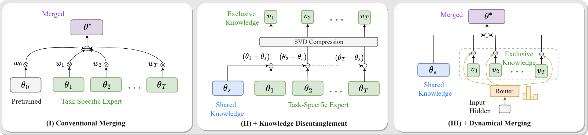
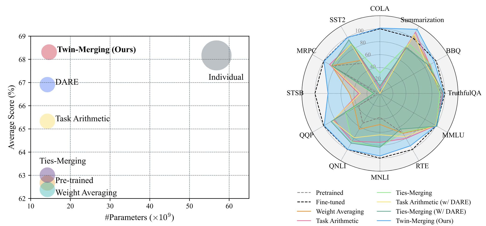

# Twin-Merging

### [Paper](https://arxiv.org/pdf/2406.15479) 

This repository provides a PyTorch implementation and checkpoint for our Twin-Merging method, introduced in our paper [Twin-Merging](https://arxiv.org/pdf/2406.15479).
Twin-Merging consists of two stages: modularizing knowledge into shared and exclusive components with compression to reduce redundancy, and dynamically merging shared and task-specific knowledge based on input. 



This approach significantly narrows the performance gap between merged and fine-tuned models, improving adaptability to heterogeneous data. It shows an average improvement of 28.34% in absolute normalized score for discriminative tasks and even surpasses the fine-tuned upper bound on generative tasks.



This repository contains:

* 🪐 A simple PyTorch implementation of Twin-Merging on 12 tasks, both discriminative and generative.
* ⚡️  Fine-tuned experts for RoBerta/Qwen, and Router checkpoints on [Huggingface Hub](https://huggingface.co/lu-vae/twin-merging-router).
* 💥 A lightweight and easy-to-run merging framework supporting typical merging algorithms, with scripts for:
    - [Weight Average](https://arxiv.org/abs/2203.05482)
    - [Task-Arithmetic](https://arxiv.org/abs/2212.04089)
    - [Ties-Merging](https://arxiv.org/abs/2306.01708)
    - [Task-Arithmetic with Dare Merging](https://arxiv.org/abs/2311.03099)
    - [Ties-Merging with Dare Merging](https://arxiv.org/abs/2311.03099)
    - [Twin-Merging (Ours)](https://arxiv.org/pdf/2406.15479)

## Setup
---

First, download and set up the repo:

```bash
git clone https://github.com/LZY-the-boys/Twin-Merging
cd Twin-Merging
```

We provide a requirements file to create a Conda environment. The Conda environment name `merging` is used in `generative/eval_scripts.sh`. 
If you change the name, update it in `generative/eval_scripts.sh` as well.

```
conda create -n merging python=3.9
conda activate merging
pip install -r requirements.txt
```

## Merging for Discriminative Models:
---

We offer examples for merging RoBERTa models tuned on the GLUE tasks. 

### Merge

For convenience, you can download a single expert for each dataset directly:
```
huggingface-cli download lu-vae/roberta-glue --local-dir roberta
```

You can find the detailed run command in  [`discriminative/scripts.sh`](discriminative/scripts.sh). 
To run other algorithms (e.g., Ties-Merging), simply use:
```
source scripts.sh
run_tie
```

### Eval

The merged model is automatically evaluated using the official Hugging Face [`evaluate`](https://huggingface.co/docs/evaluate/en/index). 
The full pipeline is in `discriminative/run.sh`. To get the results of our Twin-Merging approach, run:
```
cd discriminative
bash run.sh
```

Performance is calculated by the normalized score as shown in Equation (4) of our paper. Using `{seed=0;gpu=A100-sxm-80g}`, the results are as follows (note: results may vary slightly with different devices or seeds):

|  Merging Algorithm    |   cola |   mnli |   mrpc |   qnli |   qqp |   rte |   sst2 |   stsb |
|:-----|-------:|-------:|-------:|-------:|------:|------:|-------:|-------:|
| Ties-Merging |   9.46   | 59.34   | 74.71   | 65.93   | 41.29   | 47.29   | 72.13   |   9.21 |
| Task-Arithmetic |   6.68   | 66.23   | 78.46   | 78.62   | 72.69   | 53.43   | 83.49   |  27.1  | 
| Twin-Merging | 101.06  | 94.35 | 97.51 | 98.78 | 98.06 | 94.56 | 99.64  | 82.67 |

The reference absolute accuracy of the finetuned experts:

|   Expert   |   cola |   mnli |   mrpc |   qnli |   qqp |   rte |   sst2 |   stsb |
|:-----|-------:|-------:|-------:|-------:|------:|------:|-------:|-------:|
| cola |  56.52 |  34.17 |  74.8  |  47.15 | 33.42 | 47.29 |  51.38 |   5.41 |
| sst2 |   9.29 |  37.56 |  51.97 |  47.95 | 44.8  | 51.62 |  94.72 |   4.37 |
| mrpc |  11.1  |  35.46 |  87.99 |  60.84 | 62.01 | 47.29 |  50.46 |  57.61 |
| stsb |   0    |  32.37 |  75.17 |  58.54 | 33.62 | 47.29 |  50.92 |  86.36 |
| qqp |   0.28 |  43.06 |  77.21 |  62.64 | 89.71 | 46.57 |  50.92 |  52.32 |
| mnli |   1.72 |  87.01 |  53.29 |  49.55 | 44.91 | 28.88 |  51.26 | -24.9  |
| qnli |  18.04 |  38.76 |  74.96 |  91.71 | 34.33 | 47.29 |  55.16 | -24.07 |
| rte |  -2.12 |  34.27 |  74.8  |  56.04 | 50.77 | 66.43 |  51.38 |  49.3  |


## Merging for Generative Models:
---
We offer examples for merging Qwen-14B for four generative tasks:  MMLU, TruthfulQA, BBQ, CNN-DailyMail.

### Merge

Firstly, you should download the task-specific checkpoints:
```
huggingface-cli download lu-vae/qwen-cnn-merged --local-dir qwen/qwen-cnn
huggingface-cli download lu-vae/qwen-dolly --local-dir qwen/qwen-mmlu
huggingface-cli download lu-vae/qwen-truthfulqa-merged --local-dir qwen/qwen-truthfulqa
huggingface-cli download lu-vae/qwen-bbq-merged --local-dir qwen/qwen-bbq
```

Alternatively, you can fine-tune them using the LoRA method with the [`axolotl`](https://github.com/LZY-the-boys/axolotl/) framework. The configuration file is available [here](https://github.com/LZY-the-boys/axolotl/blob/main/examples/qwen/qlora.yml).
Their finetune dataset is uploaded in [here](https://huggingface.co/datasets/lu-vae/natural-dataset)

Then, you can run specific merging algorithm via
```
cd generative
source scripts.sh
run_task_arith
```
If using LoRA, update the `--lora` flag with your configuration JSON, as shown in [`generative/qwen_lora.json`](generative/qwen_lora.json).

### Eval 

We evaluate the merged model using [`HELM` framework](https://github.com/stanford-crfm/helm), which is one of the biggest LLM benchmark, similar to huggingface Openllmleaderboard. 
However, its environment is a bit complex to install and have problems in showing the results , we recommend use [our enhanced version](https://github.com/LZY-the-boys/HELM-Extended-Local) for a smoother experience:
```
cd generative
git clone  --single-branch --branch dev  HELM-Extended-Local
conda create -n crfm-helm python=3.8
conda activate crfm-helm
pip install -r HELM-Extended-Local/requirements.txt
pip install summ-eval jieba bert-score
```

After installing the HELM, you can run our evaluation scripts to get the merged result: 
```
cd generative 
bash eval.sh
```
Results will be saved in `generative/HELM-Extended-Local/outs` .

You should be able to reproduce similar performance as follows:

| Model/adapter      |   BBQ - EM |   CNN/DailyMail - ROUGE-2 |   MMLU - EM |   TruthfulQA - EM |   
|:-------------------|-----------:|--------------------------:|------------:|------------------:|
| Twin-Merging     |    90.7268 |                   19.9269 |     68.2704 |           53.3835 | 


## BibTeX

```bibtex
@article{Lu2024TwinMerging,
    title={Twin-Merging: Dynamic Integration of Modular Expertise in Model Merging}, 
    author={Zhenyi Lu and Chenghao Fan and Wei Wei and Xiaoye Qu and Dangyang Chen and Yu Cheng},
    year={2024},
    eprint={2406.15479},
    archivePrefix={arXiv},
    primaryClass={cs.CL},
    url={https://arxiv.org/abs/2406.15479}, 
}
```

## Acknowledgments

We would like to acknowledge the Shanghai AI Laboratory provides facilities that were crucial to the completion of this work.

